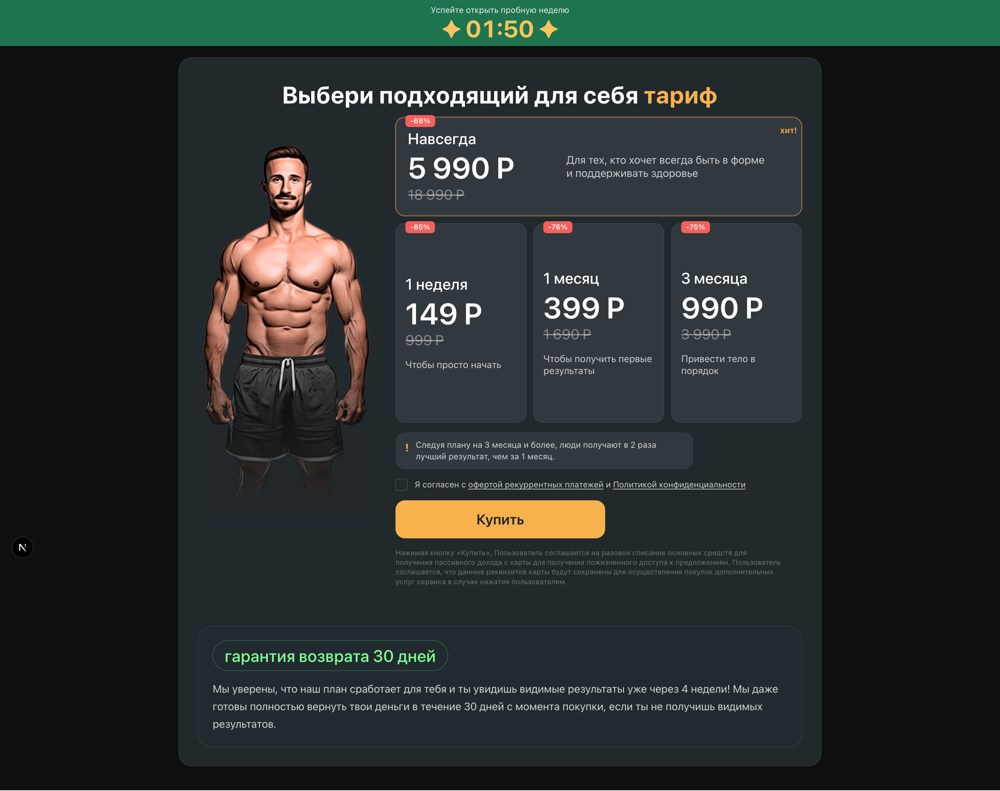
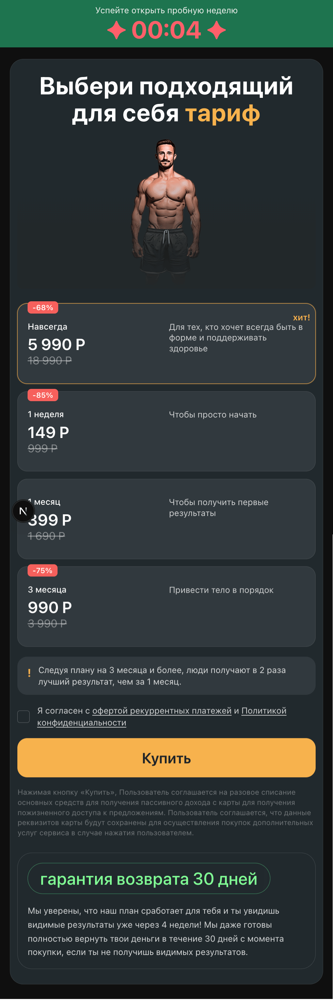
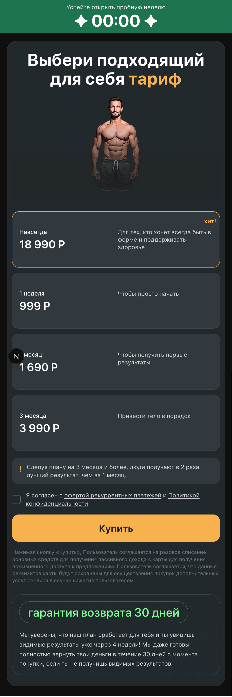

# Фитнес-зал — выбор тарифа

Лендинг выбора абонемента: таймер акции в шапке, карточки тарифов с ценой и скидкой, согласие с офертой и кнопка покупки.

## Скриншоты

### Десктоп



### Мобильная версия

**Таймер в режиме предупреждения (осталось ≤ 30 сек):**



**После истечения таймера (полные цены):**



## Стек

- **Next.js 15** (App Router)
- **React 19**
- **TypeScript**
- **Tailwind CSS**

## Требования

- Node.js 18+
- npm

## Установка и запуск

```bash
npm install
npm run dev
```

Откройте [http://localhost:3000](http://localhost:3000).

## Скрипты

| Команда | Описание |
|--------|----------|
| `npm run dev` | Режим разработки с hot reload |
| `npm run build` | Production-сборка |
| `npm start` | Запуск собранного приложения |
| `npm run typecheck` | Проверка типов TypeScript |

## Функциональность приложения

### Загрузка данных

- При открытии страницы запрашивается список тарифов с API (`GetTariffs`). Пока идёт загрузка, показывается состояние «Загрузка тарифов…»; при ошибке — сообщение об ошибке.
- После загрузки тарифы сортируются: рекомендуемый (`is_best`) выводится первым как главная карточка, остальные — сеткой из трёх карточек ниже. Выбранным по умолчанию становится рекомендуемый тариф.

### Таймер акции

- В шапке отображается обратный отсчёт (старт — 2:00). Таймер обновляется каждую секунду.
- Пока таймер идёт: на карточках показываются скидочная цена, зачёркнутая полная цена и бейдж процента скидки.
- Когда остаётся 30 секунд и меньше: цвет таймера меняется на красный и включается анимация мигания.
- После истечения таймера: скидки скрываются, на карточках отображаются только полные цены без бейджей.

### Выбор тарифа

- Карточки кликабельны. Выбранная карточка выделяется жёлтой рамкой и тенью. Можно выбрать любой тариф перед нажатием «Купить».
- Главная карточка (хит) имеет отдельное оформление (метка «хит!», другой layout на десктопе). Остальные три тарифа отображаются в адаптивной сетке (1 колонка на мобильных, 2 на sm, 3 на md+).

### Оформление покупки

- Блок с чекбоксом «Я согласен с офертой рекуррентных платежей и Политикой конфиденциальности». Ссылки ведут на оферту и политику (заглушки).
- Кнопка «Купить»:
  - Если чекбокс не отмечен и пользователь нажимает «Купить» — показывается ошибка валидации (красная обводка чекбокса), покупка не выполняется.
  - Если чекбокс отмечен — ошибка сбрасывается; в коде доступны данные выбранного тарифа для отправки на бэкенд (интеграция не реализована).
- Под кнопкой — мелкий текст об условиях списания и хранения реквизитов карты.

### Дополнительные блоки

- Информационный блок с призывом выбирать план на 3+ месяца («Следуя плану на 3 месяца и более…»).
- Блок «Гарантия возврата 30 дней» с кратким описанием условия возврата средств.

## Данные

Тарифы запрашиваются с API: `https://t-core.fit-hub.pro/Test/GetTariffs`. Формат ответа — массив объектов с полями `id`, `period`, `price`, `full_price`, `is_best`, `text`.

## Структура проекта

```
├── app/
│   ├── layout.tsx    # Корневой layout, шрифты, метаданные
│   ├── page.tsx      # Главная страница (таймер, тарифы, форма)
│   └── globals.css   # Глобальные стили и утилиты (например, hero gradient)
├── components/
│   ├── Header.tsx        # Шапка с таймером акции
│   ├── TariffList.tsx    # Список тарифов (главная карточка + сетка)
│   ├── TariffCard.tsx    # Карточка одного тарифа
│   ├── CheckboxBlock.tsx # Согласие с офертой и политикой
│   └── GuaranteeBlock.tsx# Блок гарантии возврата
├── lib/
│   ├── types.ts   # Тип Tariff
│   └── api.ts     # fetchTariffs()
├── utils/
│   └── price.ts   # formatPrice(), getDiscountPercent()
├── public/
│   └── images/    # Hero-изображения (hero-sm/md/lg.svg)
├── tailwind.config.ts
├── next.config.ts
└── tsconfig.json
```

## Особенности реализации

- Компоненты обёрнуты в `React.memo`; колбэки стабилизированы через `useCallback`, списки тарифов — через `useMemo`.
- Компоненты и утилиты оформлены стрелочными функциями; типы и `useEffect` снабжены JSDoc/комментариями.
- Адаптивная вёрстка: мобильные карточки в две колонки (цена | описание), десктоп — hero слева, контент справа.
